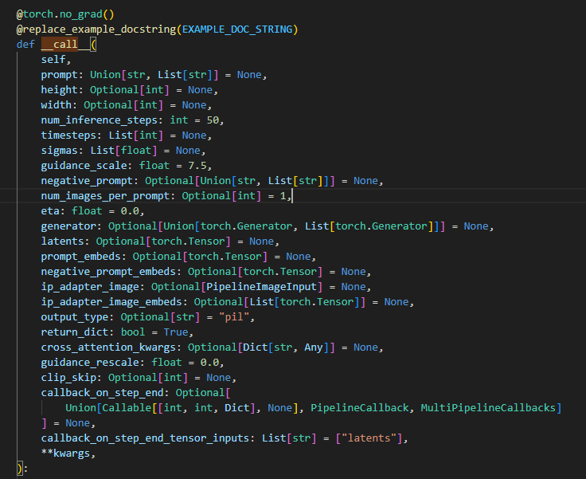
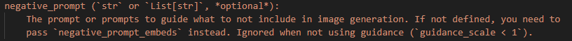
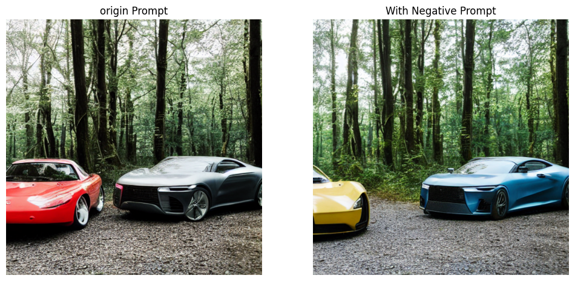
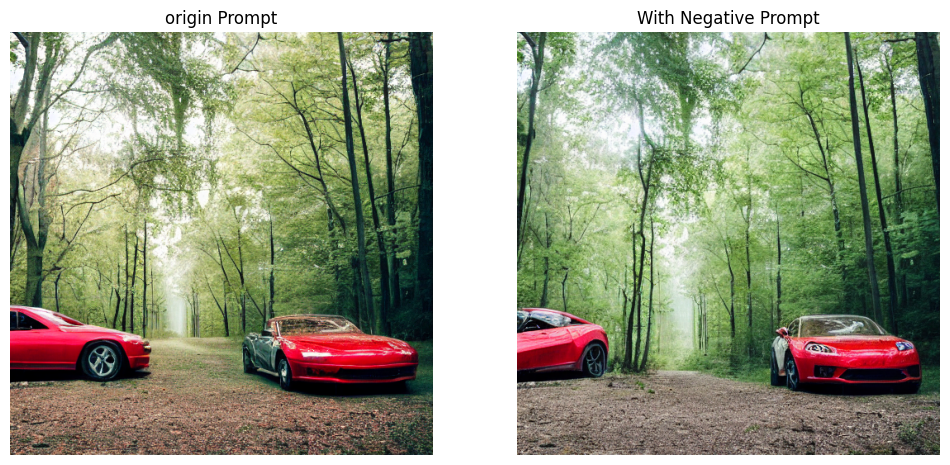
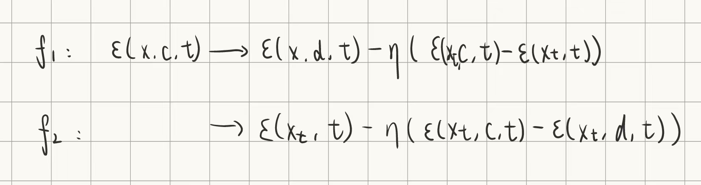
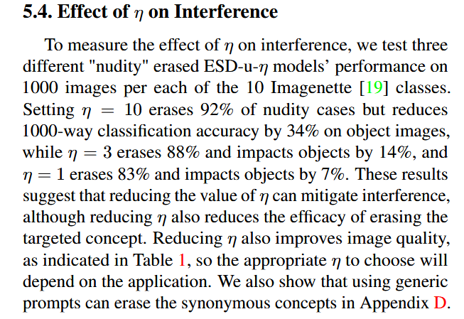
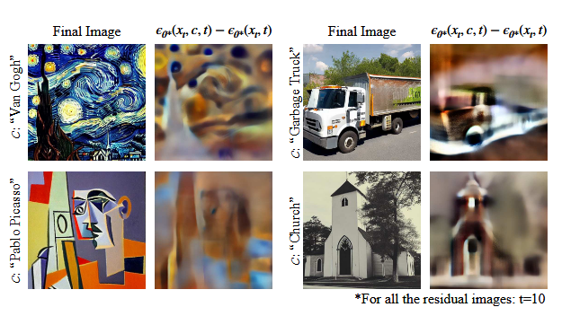
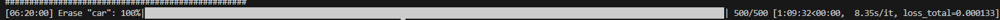

## erasing and transfer diffusion
### stable diffusion
cross attention: 
similarity of prompt and latent image
Q: image, intermediate  representation of the UNet
K,V: prompt embedding
### score-based function
$\epsilon \propto S(x)=\bigtriangledown_x \log P(x)$
密度似然
### guidance
#### classifier-free guidance

推理时引导
$\epsilon(x_t, c) = \epsilon(x_t) + \eta(\epsilon(x_t, c) - \epsilon(x_t))$
unconditional -> conditional
fundamental of erasing concept (paper)
practical meaning:
$P(x|c) \propto P(x) * (P(x|c)/P(x))^\eta$
求对x梯度->score function

diffuser库 
Stablediffusion pipeline: negative prompt


negative embedding -> unconditional prompt
$\epsilon(x_t, c) => \epsilon(x_t) + \eta(\epsilon(x_t, c) - \epsilon(x_t, d))$
$P(x|c) \propto P(x) * (P(x|c)/P(x))^\eta
->P(x|c) \propto P(x) * (P(x|c)/P(x|d))^\eta$

works well in unrelated c, d
```python
negative_prompt = "red color"
prompt = "two mixed cars in front of a forest"
```

yet worse in related c, d
```python
negative_prompt = "red color"
prompt = "two red cars in front of a forest"
```

from fomula
分子 分母，负向引导作用的冲突

### erasing
a varient of guidance
$\epsilon (x,c,t) = \epsilon (x,t) - \eta_1(\epsilon (x,c,t) -\epsilon (x,t) )$
from: 
$P(x|c) \propto P(x) / P(c|x)^\eta$
Unet学习引导


### transfer learning
f1, f2:

1. $P_\theta (x|d)*\frac{1}{P(c|x)^\eta}$
uneffective
2. similar to classifier free guidance
   unconditional -> negative prompt
3. L($\epsilon(x,c,t)-\epsilon(x,d,t)$)

no larger change
kl divergence regularization?

#### visualization inspiration
$\epsilon (x,c,t) -\epsilon (x,t)$

residual represent object information

$\epsilon_n (x,c,t) = \epsilon (x,c,t) - \eta_1(\epsilon (x,c,t) -\epsilon (x,t) ) +  \eta_2(\epsilon (x,d,t) -\epsilon (x,t) ) $
uneffective until now

$\epsilon_n (x,c,t) = \epsilon (x,c,t) - \eta_1(\epsilon (x,c,t) -\epsilon (x,t) )$
+
$\epsilon_n (x,c,t) = \epsilon (x,c,t) + \eta_2(\epsilon (x,d,t) -\epsilon (x,t) ) $


#### advanced way
adversary
a new layer after cross attention layer
'we present an adversarial prompt learning scheme to induce the model to produce images of previously erased concepts, followed by optimizing the model against such image generation.'


result: 
```python
data = [
    ['cars on the road', 123, 1],
    ['a car and a bicycle', 456, 2],
]
```
generated:  


 


lowweight(12MB) -> ESD(160MB)
long training time (adversary)
