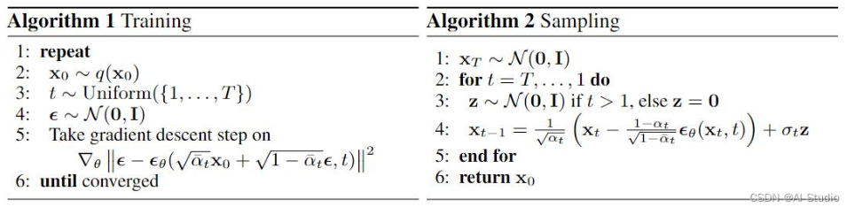
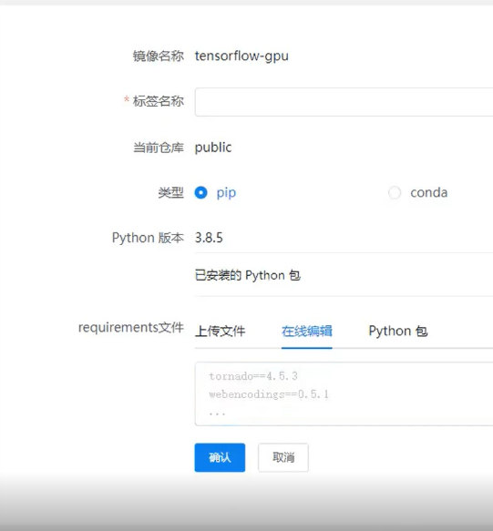

### diffusion 

denoising diffusion probabilistic models”。
DDPM: https://arxiv.org/abs/2006.11239
   
stable diffusion  

algorithm

Input: noised image + iteration  
model
output: noise predicted -> denoising

### stable diffusion  
1. text encoder to vector  
2. generation model (diffusion) Denoising U-Net  
3. decoder to final version in pixel space
parallel training   
mid journey: during training process, illustrates the results encoded from the denoising images

#### text encoder:
1. gpt coding/ BIRT
1. criteria: CLIP score/ FID-10k  
   - **FID**: standard -> pre-trained CNN classification model -> representation ；   the distance between the representation of the generated images and the representation of the real images (assumption of Gaussians distribution)  
   两组distribution的距离
   limitation: need a large scale of generated images  

   - **CLIP**: An additional Image Encoder model
   CLIP score: the vectors similarity between the encoded text and encoded generated image representations
 
#### decoder: 
feature: Training without knowing the correspondence between images and text 
intermediate: 
- compressed image: sample and downsample -> train
- latent representation:  auto-encoder  ??
    - input: H\*W\*3 latent: h\*w\*c (exceeding vision dimension)

#### generation model:
input: noised image + text  
output: intermediate  
加噪过程，改为加在中间杂序上，使用auto-encoder的encoder部分
train a noise predictor
denoising: initialized by sampling normal distribution noise

---
### 服务器
使用：
step1：上传数据
step2: 镜像下载/定制
step3: 创建交互式开发

#### docker
镜像(images) 容器(containers)
Dockerfile
- layer structure
  
workdir 设置镜像位置

User: docker run -d 这里的-d是什么 
##### execution

下面是 `docker run` 命令中一些常用选项的解释：

- `-d` 或 `--detach`：脱离模式运行容器。容器在后台运行，与运行它的命令行终端无关。
- `--name`：为容器指定一个名称。
- `-p` 或 `--publish`：端口映射，将容器内部的端口映射到宿主机的端口。
- `-e` 或 `--env`：设置环境变量。
- `-v` 或 `--volume`：挂载卷，将宿主机的文件系统挂载到容器内部。
- `--network`：指定容器的网络连接。
- `--restart`：设置容器的重启策略。
- `--cpus`：限制容器可以使用的CPU资源。
- `--memory` 或 `-m`：限制容器可以使用的内存大小。

例如，如果你想要运行一个名为 `my_container` 的容器，并且希望它在后台运行，可以使用以下命令：

```sh
docker run -d --name my_container my_image
```

这里 `my_image` 是你想要运行的镜像的名称。容器将使用 `my_image` 镜像创建，并在后台运行，同时被命名为 `my_container`。 


#### 数据传输与环境配置
- 上传
使用filezilla
共享数据

- 环境配置
选取镜像  
  - 制作镜像-> 使用requirement文件（使用conda/pipd）

  - or (console)
  SSH `apt-get update` or `pip install`


## bug
服务器无conda环境

---