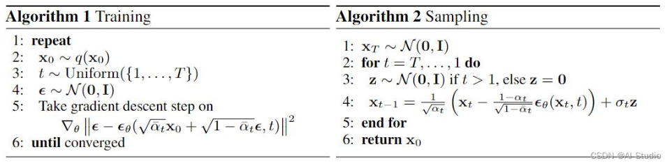
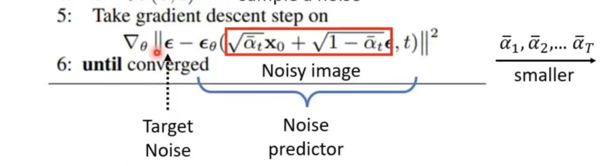
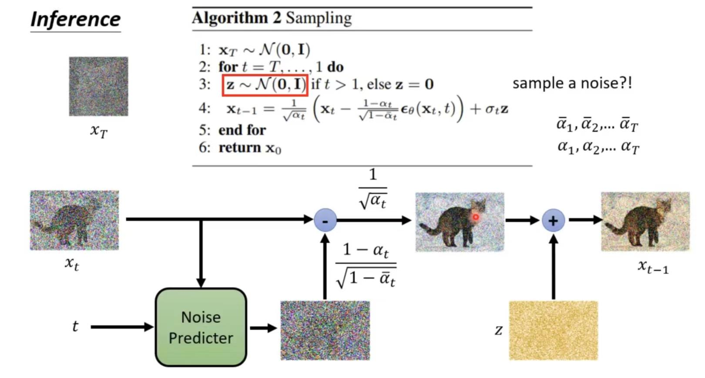
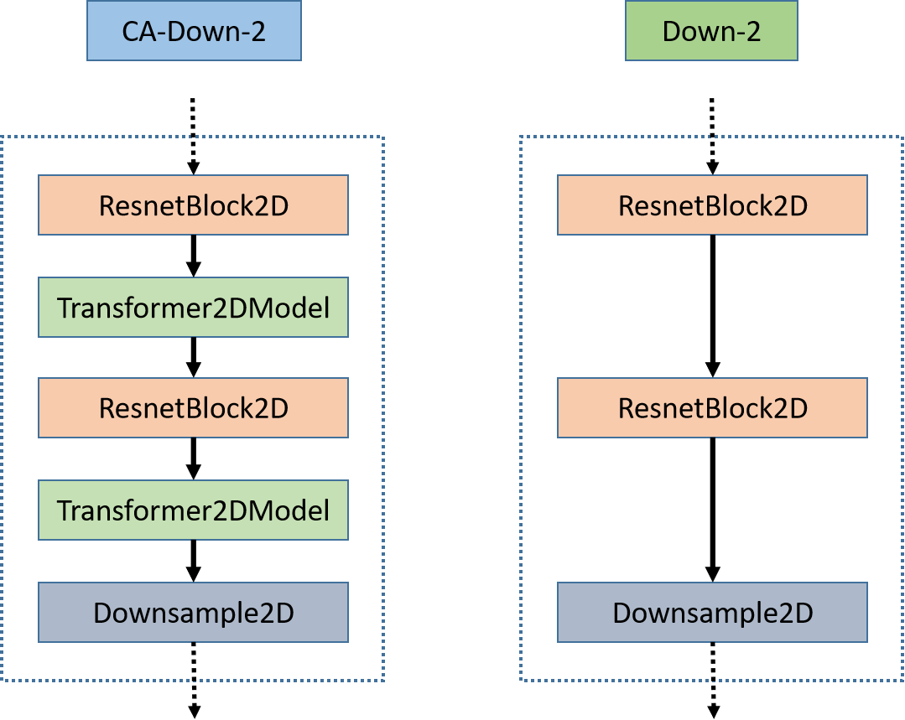
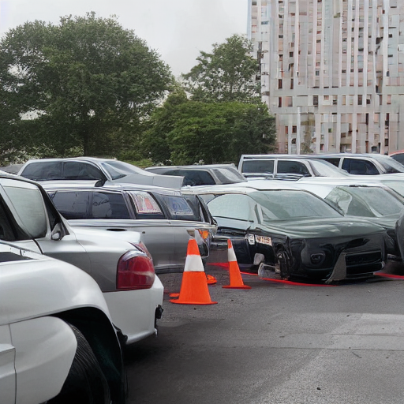

## diffusion 

denoising diffusion probabilistic models”。
DDPM: https://arxiv.org/abs/2006.11239

Input: noised image + iteration  
model
output: noise predicted -> denoising

### stable diffusion  
1. text encoder to vector  
2. generation model (diffusion) Denoising U-Net  
3. decoder to final version in pixel space
parallel training   
mid journey: during training process, illustrates the results encoded from the denoising images

#### text encoder:
1. gpt coding/ BIRT
1. criteria: CLIP score/ FID-10k  
   - **FID**: standard -> pre-trained CNN classification model -> representation ;   the distance between the representation of the generated images and the representation of the real images (assumption of Gaussians distribution)  
   两组distribution的距离
   limitation: need a large scale of generated images  

   - **CLIP**: An additional Image Encoder model
   CLIP score: the vectors similarity between the encoded text and encoded generated image representations
   multimodal encoder

#### decoder: 
feature: Training without knowing the correspondence between images and text 
intermediate: 
- compressed image: sample and downsample -> train
- latent representation:  auto-encoder  
    - input: H\*W\*3 latent: h\*w\*c (exceeding vision dimension)

#### generation model:
input: noised image + text  
output: intermediate  
text(additional): condition (can be ignored during inferation)
加噪过程，改为加在中间杂序上，使用auto-encoder的encoder部分
train a noise predictor
denoising: initialized by sampling normal distribution noise

#### SR3
purpose: super-resolution
method: 
  - condition: low resolution image
  - output: super-resolution
SR3通过一个随机迭代去噪过程来执行超分辨率，输出图像以纯高斯噪声初始化，并使用一个在不同噪声水平下训练的U-Net架构进行迭代细化

application: cascade after a generative model
级联图像生成中发挥作用，即将一个生成模型与超分辨率模型链式连接，以合成具有竞争性的FID分数的高分辨率图像

**image preprocessing**: 
1. downsample f=4, and then 双三次插值（bicubic interpolation）
2. alternative: degration pipeline from [105], which is：
The BSR-degradation process is a degradation pipline which applies JPEG compressions noise, camera sensor noise, different image interpolations for downsampling, Gaussian blur kernels and Gaussian noise in a random order to an image.
[105]: K. Zhang, Jingyun Liang, Luc Van Gool, and Radu Timofte. Designing a practical degradation model for deep blind image super-resolution. ArXiv, abs/2103.14006, 2021.

### algorithm  
#### part 1 training

loss function during training:
2. xo -> clean images
4. $\epsilon$ samples from normal distribution ($\mu$ = 0,v = 1)
5. 

inside:  weighted sum, noising  
  the larger t is, the more proportion the noise added  
$\epsilon_\theta$ : noise predictor
input: noisy image + t(step/iteration)
output: predicted noise image  
compared with the target noise you have sampled in **step 4**  

**difference with origin steps**
noise and denoise step by step  < <u>DDPM training </u>> predicting the noise by once  
why?

#### sample
generate image

strangeness: elinimate the predicted noise and add a new one afterward (plus signal)

### theory
map the generated **distribution** to the actual world distribution
Q: to measure the similarity of the two distribution
A: maximum likelihood Estimation:(MLE)  
  $P_\theta(x)<->P_{data}(x)$  
  sample  
**all objective for image generation model**

#### KL divergence 
KL diverges: 衡量两种分布差异程度
  definition：$D_{KL}(P \| Q) = \int p(x) \log \left(\frac{p(x)}{q(x)}\right) dx$
非对称性 assymmetry
#### VAE encoder & diffusion model
q(z|x)
given the image:x, the distribution of the latent space (p(z|x))
also called posterior distribution  
z: distribution (major Gaussians) given the data x (x -> image to imitate)
<!-- maximize lower bound -->
maximize *lower bound of logP(x)*
VAE:
$\mathbb{E}_{q(z|x)}[\log{\frac{p(x,z)}{q(z|x)}} ]$
DDPM: z->x_0
$\mathbb{E}_{q(x_1:x_T|x)}[\log{\frac{p(x_0:x_T)}{q(x_1:x_T|x)}} ]$

reparameterize trick:
$z=μ_λ​+σ_λ⊙\epsilon$  

## diffusers
### unet
1. Additionally, the stable diffusion U-Net is able to condition its output on text-embeddings via **cross-attention** layers.
2. short-cut connections are usually added between the downsampling ResNets of the encoder to the upsampling ResNets of the decoder
3. The cross-attention layers are added to both the encoder and decoder part of the U-Net usually between ResNet blocks.

下采样、中间层、上采样

而Transformer2DModel也使用了嵌入（包含交叉注意力和自注意力），提供指导信息（context）的时候就执行交叉注意力，否则就执行自注意力，例如我的输入是 X ，context 是 E，如果 E 不为空我们就对 X 和 E 执行自注意力操作（即使用 X 的变换作为 Q 、使用 E 的两个变换分别作为 KV），如果 E 为空我们就对 X 和 X 执行注意力操作（即 KQV 由 X 的三个线性变换得到），前者是交叉注意力，后者是自注意力
\* Conv2d 并没有进行size放缩
即通过文本得到图像中文本对应的内容，并将其给予更高的权重，比如我们给定文字中有猫，那么经过交叉注意力计算后，图像中猫的区域就会被**标记**出来。
The non-pooled output of the text encoder is fed into the UNet backbone of the latent diffusion model via cross-attention.

## unlearning (erasing concepts)  
### related work  
#### concept censorship  
Prior approaches have focused on **dataset filtering [30], post-generation filtering [29], or inference guiding [38]**
- removal or guidance
post-hoc: using classifier after training
adding guidance to the inference process \*[38]
[38] Patrick Schramowski, Manuel Brack, Björn Deiseroth, and Kristian Kersting. Safe latent diffusion: Mitigating inappropriate degeneration in diffusion models. arXiv preprint arXiv:2211.05105, 2022.
sota guidance-based approach
- image cloaking
  adding adversarial perturbations
#### model edit
GAN -> diffusion model  
by a token for a new subject trained using only a handful of images  
#### unlearning
previous assumption: unintentional memorization; undesired knowledfe is identifiable on a set of training data points  
our: erase a high-level visual concept
fine tune  
### inspiration and source
set-like composition?
**energy-based models** EBM  
A and not B as the difference between log probability densities for A and B
[10], [11], [37], [38]  
score based composition  
reference: 
<!--  -->
(source/Kimi.jpg)
### limitation
interference of others
trade off on the erasing effect and interference
tends to erase only the main elements
E: discard the car

## experiments
### metrics
1. Tuomas Kynka ̈a ̈nniemi, Tero Karras, Samuli Laine, Jaakko Lehtinen, and Timo Aila. Improved precision and recall metric for assessing generative models. CoRR, abs/1904.06991, 2019.
2. FID

---
